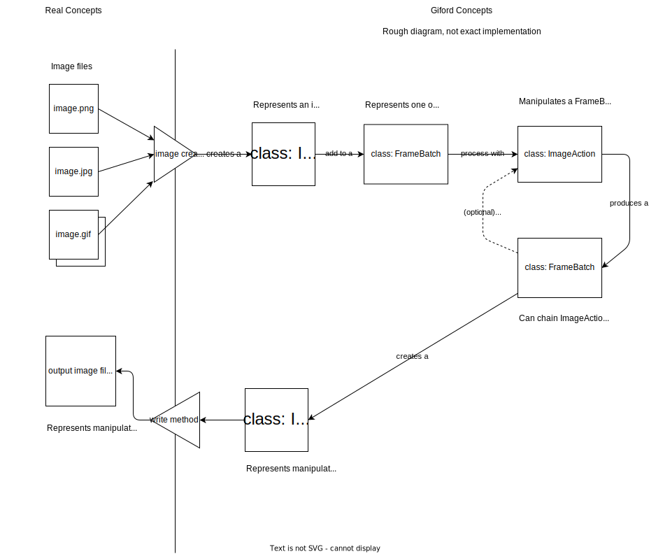

# giford
[](https://github.com/whale-net/giford/actions/workflows/pytest.yml)
[](https://codecov.io/gh/whale-net/giford)
[](https://codecov.io/gh/whale-net/giford/graphs/sunburst.svg?token=QX182ZYMHN)


## about
modify images and create gifs with unified toolkit

### concepts



### class diagram (very crude)


## manifesto:
lowercase because it's friendly

newlines at end of files because it's nice

if you understand why an image manipulation library needs a manifesto, then you arent thinking little enough

## setup
todo - package config
packages - scikit-image (skimage), ffmpeg
python sample_run.py

python >=3.7
needed because:
```
from __future__ import annotations
```

install required modules
```
pip install -e .

# if running development locally do this:
pip install -e .[dev]
```

## building

```
pip install build
pip install setuptools-scm
python -m build
```


## sometimes things don't go right
